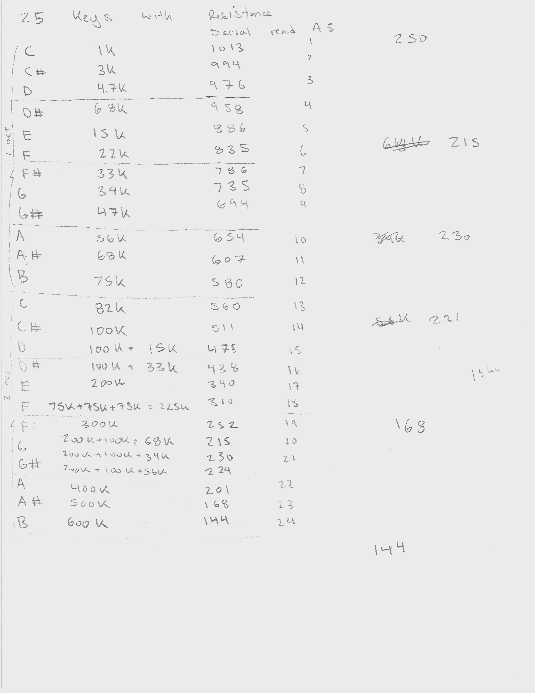
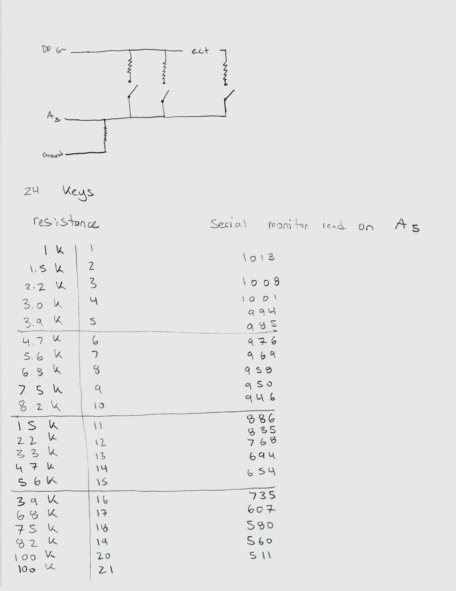

# Analog Synthesizer

This repository is a collection of documents and code representing the analog synthesizer created by Matthew Muller for the Normandale Community College Student Showcase.

## How Does This Synthesizer Work?

This synthesizer is a "hack" of a normal keyboard that has been converted to work with an arduino. 

##### Normal Keyboard

Keyboards today typically use timing and a cpu to detect which key has been pressed. This is done by having each key be assigned a diode. When the key is pressed, the diodes timing lets the CPU know that particular key has been hit. This synthesizer works a little bit differently.

##### This Analog Keyboard

The way this keyboard works is each key acts as a switch in a circuit. The keys are all hooked up in parallel and are open when not pressed. When a key is struct, the circuit completes and voltage passes through the switch. Each key has a different resistance, so the voltage being received at the end of the circuit is different based upon which key is pressed. This voltage can then be read by the arduino. The arduino takes this voltage reading and plays a note based upon what note has been mapped to that voltage.

## How Was The Keyboard "Hacked"?

The way this keyboard was put together was by taking an existing keyboard and modifying it. The keyboard used had an individual circuit for each key that was fed into an integrated circuit chip. The picture below shows the underside of the keyboard. You can see how the keys press into a circuit board, completing a circuit every time a key is pressed.

I began by short circuiting each key together, so electricity could travel into the keyboard through one connection and exit through another. I first had to remove the circuit board from the keys. I could then short the leads of each key together. This turned the keyboard from each key being its own connection into a keyboard where each key was connected in a single, parallel circuit. This process was tricky to make sure the solder only shorted what we wanted and not the entire circuit. Below is a picture of the leads shorted together. 

After shorting the leads on the board together, I had to short the ribbon cable together. Also, the previous ribbon cable had a cap on it that fit into another board containing the previous keyboards main CPU. To short the cable, I cut off the ribbon cable cap, pulled apart the individual ribbons, and soldered them together. 

**Note:** If you are doing this with a ribbon cable, make sure you understand where each ribbon of a ribbon cable leads to on the circuit board. For my cable, every other ribbon carried current down and then up. I had to thread every other ribbon together in order to have my circuit be parallel. 

The picture below shows the final product consisting of ribbon cables twisted together and turned into a single cable. This was done by stripping back the wire on the ends of each ribbon cable and twisting them together with another wire that has been stripped back. I then applied solder to hold the twisted wires together.

I then finished with some heat shrink over the top to cover the solder and protect the cable. The picture below shows the final product as well as the original ribbon cable connector I removed.

Next, I clipped and desoldered all the diodes from the circuit board. Then, starting with a resistance of 1k ohms, I soldered in resistors in place of where the diodes were. The picture below shows the board after I clipped out the diodes and began installing the resistors.

After installing the resistors, I reassembled the keyboard and was ready to connect it up to the ardunio.

## Resistance Mapping

The diagrams below show the resistance values for each key and the mapping of each key to the voltage reading of each key. These mapping are read in by the arduino on pin A5 and based upon the reading, turned into a note. 

To read these values I did the following:

* Connected one wire into the 5v pin on the arduino
* Connected the other wire to a breadboard and split it two ways
	* One went to a 10k resistor and then ground
	* The other went to the A5 pin on the arduino
	
The reason I did not just connect the second wire into the A5 pin is because you want to debase the connection when you stop pressing a key. Think of debasing as removing all the potential electrical current from the circuit. When a key is unpressed, the circuit grounds out. As for the 10k resistor, that is in the circuit to add resistance to the ground for when a key is pressed. Otherwise, the potential of the circuit would always be pointing at ground and the A5 pin would never have a reading.

## The Code

The concept of how the code works is pretty simple. The program looks at the A5 pin and reads the voltage. It then does a bunch of checks to see if that voltage falls inside of a range. If it does, it then plays a corresponding note based upon how it was mapped. You can look at inline comments for more detail about how the code is working.

## Digital or Analog?

While the keyboard is analog in nature, the sound itself is digitally synthesized. I used the arduino to not only control the keyboard, but to also create the sound. I plan to work on a fully analog synthesizer in the future, but for practicality, blended the two together.

## The final product

#### PNP Fuzz Face Distortion Pedal

I used a schematic online to create an analog distortion pedal. I added this to my synthesizer to add another layer of sound possibilities. In my writeup and schematic it will be a black box. To learn about that project and schematic, visit the following link: [PNP Fuzz Face Distortion Pedal](http://www.muzique.com/lab/fuzzface.htm)

#### Pre-Amp

For my design I also used a pre-amp purchased online. To create my own, parts would of been about $15 and a few hours of time. Considering one from eBay was only $20, I decided to just go ahead and purchase one.

A pre-amp is needed to amplify the signal the arduino and distortion pedal produce. Without amplification, there would not be enough potential to power a speaker.

#### The setup

I needed a control center to operate all the parts of the synthesizer. Ultimately, I decided on using an altoids can to be my control center. I used two potentiometers(One for volume and one for distortion), and one switch (Used to turn the distortion pedal off and on).

In the pictures below, you can see the final setup. The breadboard was used to connect the keyboard to the distortion pedal and to the ardunio.

